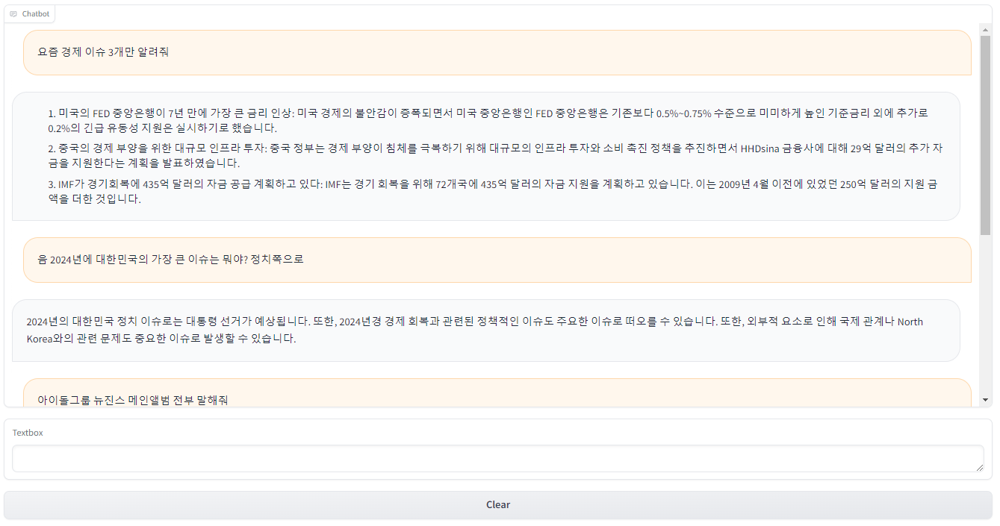

# LLM_to_Chatbot

 

 

**[ LLM 이란? ]**

- 대형 언어 모델(LLM)은 방대한 양의 데이터를 기반으로 사전 학습된 초대형 딥 러닝 모델이다.
  
- 모델은 "자기 지도 학습(self-supervised learning)" 방식으로 사전 훈련되며, 대량의 텍스트 데이터를 사용하여 다음 단어를 예측하도록 학습된다.
  
- 일반적으로 LLM은 다양한 자연어 처리 작업에 적용될 수 있으며, 텍스트 생성, 감정 분석, 문장 유사도 측정 등 다양한 작업에 활용된다.

 

**[ 동작 원리 ]**

- LLM 작동 방식의 핵심 요소는 단어를 나타내는 방식이다.
  
- 일반적인 형태의 기계 학습은 숫자 표를 사용하여 각 단어를 표현하나 비슷한 의미를 가진 단어와 같은 단어 간의 관계를 인식할 수 없다.
  
- 하지만 워드 임베딩과 같은 다차원 벡터를 사용하여 벡터 공간에서 문맥상 의미가 비슷하거나 다른 관계가 있는 단어가 서로 가깝도록 단어를 표현함으로써 어느정도 한계를 극복했다.

- Transformer는 워드 임베딩을 사용하여 인코더를 통해 `텍스트를 숫자 표현으로 사전 처리하고 비슷한 의미를 가진 단어 및 구문의 문맥은 물론 품사와 같은 단어 간의 기타 관계를 이해`할 수 있다.

- 그러면 LLM은 `디코더를 통해 이러한 언어 지식을 적용하여 고유한 출력을 생성`할 수 있습니다.

- 즉, Transformer 아키텍처 내에 Encoder는 말을 학습하고 이해하는 과정이 이루어지며 Decoder는 말과 같은 출력을 담당하는 부분이다.

  

## Tech Trend to Longchain

- 현재 NLP 모델의 대부분은 Transformer 아키텍처를 기반으로 하며, 모델의 용도에 따라 트랜스포머의 Encoder, Decoder를 개별 또는 통합하여 사용하는 추세다.

- Transformer 아키텍처의 발전 양상은 LLM의 발전 양상으로 이어지며 2021년도 이후 Encoder 보다 Decoder 중심에 대한 발전된 경향을 보인다.

- 현재는 LLM 시장에 있어 GPT-4 모델이 가장 우수한 성능을 보이는 것으로 알려져 있다.

- 하지만 GPT 시리즈는 Closed Source 기반으로 현재로서 Open Source에서는 Llama 계열의 LLM 모델이 가장 Cloused source와 유사한 성능을 보유하고 있다.

  하지만 개발 난이도가 높은 편이며 해당 모델을 사용하기 위한 GPU 서버가 필요하다는 전제가 있다.

  

## Link

- 서울과학기술대학교 , Teddysum , 연세대 MLPLab 에서 개발한 모델이며 모델에 대한 이해화 학습을 목표로 진행합니다.

  

## Model Introduce

 

**[ Llama-3-Open-Ko-8B ]**

- Llama-3-Open-Ko-8B 모델은 "Llama-3-8B"를 기반으로하여 60GB 이상의 중복 제거된 텍스트와 공개적으로 사용 가능한 리소스를 이용하여 학습되었다.
  
- 이 모델은 한국어 토크나이저를 사용하여 177억 개 이상의 토큰으로 사전 학습되었다.

- 60GB 이상의 중복 제거된 텍스트와 함께 공개적으로 사용 가능한 리소스 포함되었다.

- LLAMA3에 CHAT VECTOR 논문 방식으로 튜닝한 모델으로도 소개되어있다.

 

**[ MLP-KTLim/llama-3-Korean-Bllossom-8B ]**

- Bllossom 언어 모델은 LLama3를 기반으로 한 한-영 이중 언어 모델로, 한국어와 영어의 지식 연계성을 높여주며, 한국어 표현력을 향상시키기 위해 어휘 확장을 제공한다.
  
- 특화된 데이터를 활용하여 한국어와 한국 문화에 맞춤형 명령어를 제공하고, 인간 피드백을 반영하고, 비전-언어 정렬을 지원한다.

- 한국어 최초! 무려 3만개가 넘는 한국어 어휘확장
  
- Llama3대비 대략 25% 더 긴 길이의 한국어 Context 처리가능
  
- 한국어-영어 Pararell Corpus를 활용한 한국어-영어 지식연결 (사전학습)
  
- 한국어 문화, 언어를 고려해 언어학자가 제작한 데이터를 활용한 미세조정

  
